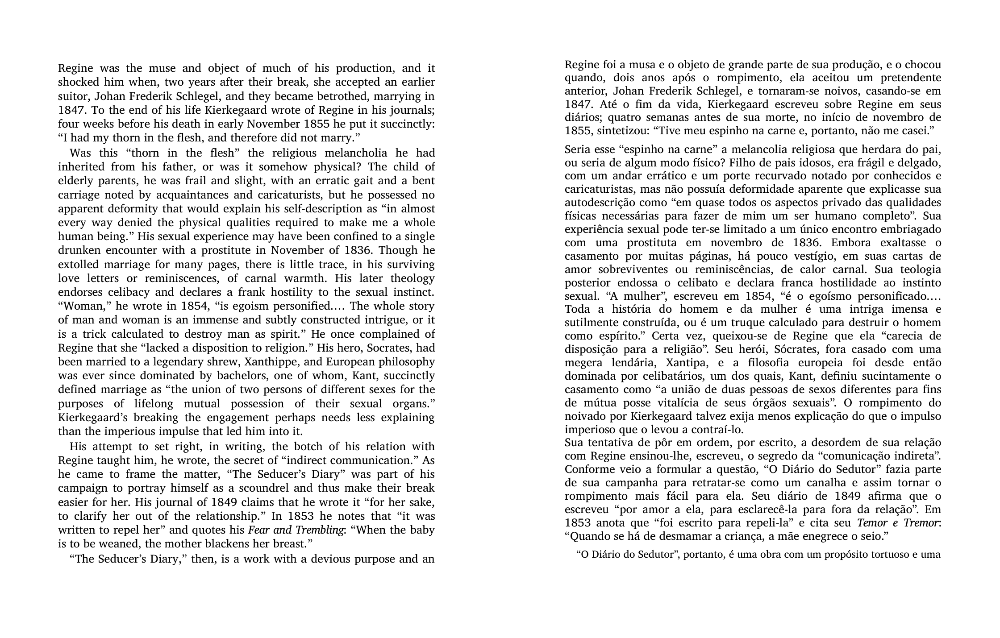
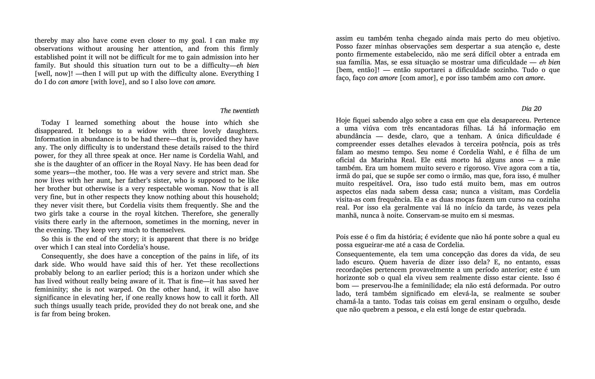

# 📖 PDF Literary Translator

> **Translate any PDF into another language while preserving its layout, fonts, italics, and images — typeset like a real book.**

<p align="center">
  
  <br />
  <em>Left: Kierkegaard's <strong>The Seducer's Diary</strong> (Princeton UP, 1987). Right: the same page after running this tool — translated to Brazilian Portuguese, same serif font, same italics, same justified columns.</em>
</p>

<p align="center">
  
  
  
  
  
</p>

---

## ✨ Why this exists

PDF translation is a solved problem — until you actually try it.

The naive approach (`pdfplumber` + `reportlab`) destroys layout. The slightly less naive approach (`PyMuPDF.insert_textbox`) preserves bounding boxes but:

- 🔴 Replaces the original serif font with **Helvetica** (book → website).
- 🔴 Drops every **italic**, every **bold**, every typographic nuance.
- 🔴 Loses **images**, page decorations, footnote markers.
- 🔴 **Silently truncates** when the translated text is longer than the original (Portuguese is ~20% longer than English; that overflow gets eaten).
- 🔴 No layout justification.

This tool does it properly:

- ✅ Embeds **CharisSIL** (a beautiful serif designed for scholarly reading).
- ✅ Preserves **per-span italic and bold** ranges — Latin phrases stay italicised in the translation.
- ✅ Keeps every **image** untouched (covers, frontispieces, diagrams).
- ✅ **Auto-shrinks** the font and expands the rect when the translation overflows — no clipping.
- ✅ Renders justified, with proper line height, line breaks, and HTML-grade typography.
- ✅ Splits cleanly into `extract` and `render` so you can edit translations by hand or pipe them in from any source (LLM, MT API, you).

The result: a translated PDF that looks like a real published book, not a homework assignment.

---

## 📸 More examples

<p align="center">
  
  <br />
  <em>Diary entry, page 51. Note how <code>con amore</code>, <code>eh bien</code>, the chapter heading <code>Dia 20</code>, and the bracketed translator's gloss <code>[com amor]</code> all retain their original typographic treatment.</em>
</p>

---

## 🚀 Quick start

```bash
# 1. Clone and install
git clone https://github.com/<your-username>/pdf-literary-translator.git
cd pdf-literary-translator
python -m venv venv && source venv/bin/activate
pip install -r requirements.txt

# 2. Download CharisSIL fonts (Open Font License)
mkdir -p fonts && cd fonts
curl -sSL -o charis.zip https://software.sil.org/downloads/r/charis/Charis-7.000.zip
unzip -j charis.zip 'Charis-7.000/Charis-Regular.ttf' \
                    'Charis-7.000/Charis-Italic.ttf' \
                    'Charis-7.000/Charis-Bold.ttf' \
                    'Charis-7.000/Charis-BoldItalic.ttf' \
                    'Charis-7.000/OFL.txt'
rm charis.zip
cd ..

# 3. Extract translatable blocks from your PDF
python translate.py extract my_book.pdf blocks.json

# 4. Translate the blocks (see "Translation workflow" below)

# 5. Render the final PDF
python translate.py render my_book.pdf output.pdf blocks.json translations/
```

---

## 🧠 How it works

```
┌─────────────────┐    ┌──────────────────┐    ┌─────────────────────┐
│  Source PDF     │───▶│   extract        │───▶│   blocks.json       │
│  (any language) │    │  (PyMuPDF dict)  │    │   {key, text,       │
└─────────────────┘    └──────────────────┘    │    italic_ranges,   │
                                                │    bbox, size}      │
                                                └──────────┬──────────┘
                                                           │
                                                           ▼
                                                ┌─────────────────────┐
                                                │   Your translator   │
                                                │  (LLM, API, human)  │
                                                └──────────┬──────────┘
                                                           │
                                                           ▼
                                  ┌────────────────────────────────────┐
                                  │   translations/*.json shards       │
                                  │   { key: { translation,            │
                                  │            italic_runs } }         │
                                  └────────────────┬───────────────────┘
                                                   │
                          ┌────────────────────────▼──────────────────┐
                          │   render                                   │
                          │   • cover original block with white rect   │
                          │   • insert_htmlbox(rect, html, css,        │
                          │       archive=fonts/, scale_low=0.5)       │
                          │   • CSS resolves @font-face → CharisSIL    │
                          │   • <i> tags from italic_runs              │
                          │   • on overflow: expand 30%, shrink 60%    │
                          └────────────────────────┬──────────────────┘
                                                   │
                                                   ▼
                                       ┌──────────────────────┐
                                       │  Translated PDF      │
                                       │  (same pagination,   │
                                       │   serif, italics)    │
                                       └──────────────────────┘
```

The key insight is **separation of concerns**. Layout extraction and rendering live in this tool; translation itself is your problem and your choice. Plug in:

- a paid API (DeepL, Google Cloud Translation, OpenAI, Anthropic),
- a local LLM (`llama.cpp`, `ollama`),
- a human translator with a JSON editor,
- or a hybrid pipeline.

---

## 🛠️ Translation workflow

### The block format

Each entry in `blocks.json` looks like:

```json
{
  "key": "39a4f7a7:0010:000:4f264fc79676",
  "page": 10,
  "idx": 0,
  "rect": [72.0, 72.0, 540.0, 182.0],
  "text": "Regine was the muse and object of much of his production…",
  "italic_ranges": [[460, 478]],
  "bold_ranges": [],
  "font_size": 14.4
}
```

### The translation shard format

`translations/<anything>.json` maps block keys to translations:

```json
{
  "39a4f7a7:0010:000:4f264fc79676": {
    "translation": "Regine foi a musa e o objeto de grande parte de sua produção…",
    "italic_runs": [[460, 478]]
  }
}
```

`italic_runs` are half-open `[start, end)` character offsets in the **translated** text, marking which segments should be italicised. The `render` command applies them as `<i>` tags before passing to PyMuPDF's HTML engine.

### The `build_shard.py` helper

Computing character offsets by hand is brittle. Use the helper instead — write italics as **phrases**:

```json
[
  {
    "key": "39a4f7a7:0010:000:4f264fc79676",
    "translation": "…cita seu Temor e Tremor: 'Quando se há de desmamar a criança…'",
    "italic": ["Temor e Tremor"]
  }
]
```

Then convert to a proper shard:

```bash
python build_shard.py my_input.json translations/batch_001.json
```

The helper finds every occurrence of each phrase in the translation and emits the offsets automatically. It also merges overlapping ranges and warns if a phrase isn't found.

### Sharding

You can split your translations across **multiple files** in `translations/`. The `render` command merges them (later files override earlier ones for the same key). This is great for:

- Translating a long book in batches without one massive JSON.
- Pipeline-friendly architectures: one shard per chapter / per page / per LLM call.
- Re-translating individual blocks without touching others.

---

## 📚 Real-world example: Kierkegaard's *The Seducer's Diary*

This tool was built to translate Søren Kierkegaard's *The Seducer's Diary* (Princeton UP, 1987 — Hong & Hong's English translation) into Brazilian Portuguese. 162 pages, 656 text blocks, 453 italic spans.

The screenshots above are real output from this very codebase. The translation maintains:

- **Book titles** in italic: *Either/Or* → *Ou-Ou*, *Fear and Trembling* → *Temor e Tremor*, *Stages on Life's Way* → *Estágios no Caminho da Vida*.
- **Latin phrases** verbatim and italicised: `con amore`, `vita ante acta`, `actiones in distans`, `conditio sine qua non`.
- **German interjections** like `unheimliche`, `langweilige`, `Winkelzüge`.
- **Greek** `αὐτάρκεια`.
- **Translator's bracketed glosses** preserved: `[com amor]`, `[bem, então]`.
- **Consistent character names** across 162 pages: Cordelia, Johannes, Regine, the seducer.

---

## ⚙️ CLI reference

```
python translate.py extract INPUT.pdf BLOCKS.json
    Walk every page, dump every text block (with italic/bold ranges, bbox,
    font size, hash-based stable key) to a JSON file.

python translate.py render INPUT.pdf OUTPUT.pdf BLOCKS.json TRANSLATIONS
    Apply translations onto the original PDF and write OUTPUT.
    TRANSLATIONS may be a single .json file OR a directory of *.json shards.
    Blocks without a translation entry are left in the original language.
```

```
python build_shard.py INPUT.json OUTPUT_SHARD.json
    Convert the human-friendly italic-by-phrase format into the canonical
    italic-by-offset shard format. Useful for bulk translation by humans
    or LLMs that don't want to count characters.
```

---

## 🏗️ Architecture decisions

**Why PyMuPDF and not pdfplumber + reportlab?**
`reportlab` rebuilds pages from scratch — pagination shifts, images vanish, layout is gone. PyMuPDF's `insert_htmlbox` lets us patch text in-place over the original page, which keeps everything else intact: images, page numbers, decorations, exact pagination.

**Why CharisSIL?**
It's freely licensed under the SIL Open Font License, ships with proper italic and bold variants, has excellent Latin/Greek/IPA coverage, and was designed specifically for long-form reading at small sizes — exactly the use case for translated literary prose.

**Why JSON shards?**
JSON is editable in any tool, diffable in git, mergeable, parseable from any language. The block-keyed format means you can re-translate one paragraph six months from now without re-running the entire pipeline.

**Why split extract/render instead of one-shot?**
You usually want to look at the translations before committing 30 minutes of GPU time to render. Splitting also enables resumable workflows: extract once, translate progressively, render whenever.

---

## 📦 Requirements

- Python 3.10+
- [PyMuPDF](https://pymupdf.readthedocs.io/) ≥ 1.23 (for `insert_htmlbox`)
- [Pillow](https://python-pillow.org/) (only if you want to generate side-by-side comparison images)
- [CharisSIL](https://software.sil.org/charis/) fonts

See `requirements.txt` for exact versions.

---

## 🤝 Contributing

PRs welcome! Some directions that would be especially useful:

- 🌐 Built-in adapters for common translation backends (DeepL, OpenAI, Anthropic, Google).
- 🔤 Auto-detection of source language so users don't have to configure it.
- 🎨 More font choices besides CharisSIL.
- 📐 Better handling of multi-column layouts.
- 🧪 A test suite using a small synthetic PDF.

---

## 📜 License

MIT — see [`LICENSE`](LICENSE). The bundled CharisSIL fonts are distributed under the [SIL Open Font License](fonts/OFL.txt).

This tool **does not include** any source PDFs or copyrighted text. You bring your own PDF; the tool transforms it locally on your machine.

---

## 🙏 Credits

- Built on [PyMuPDF](https://pymupdf.readthedocs.io/) by Artifex Software.
- Typography by [SIL International](https://software.sil.org/charis/) — CharisSIL.
- The Kierkegaard demo translation was produced by an LLM workflow as a one-off literary exercise; this repository contains the **tool**, not the translation itself, in respect of Princeton University Press's copyright on the Hong & Hong English edition.

---

<p align="center">
  <em>If this saved you a weekend, a star ⭐ would mean a lot.</em>
</p>
